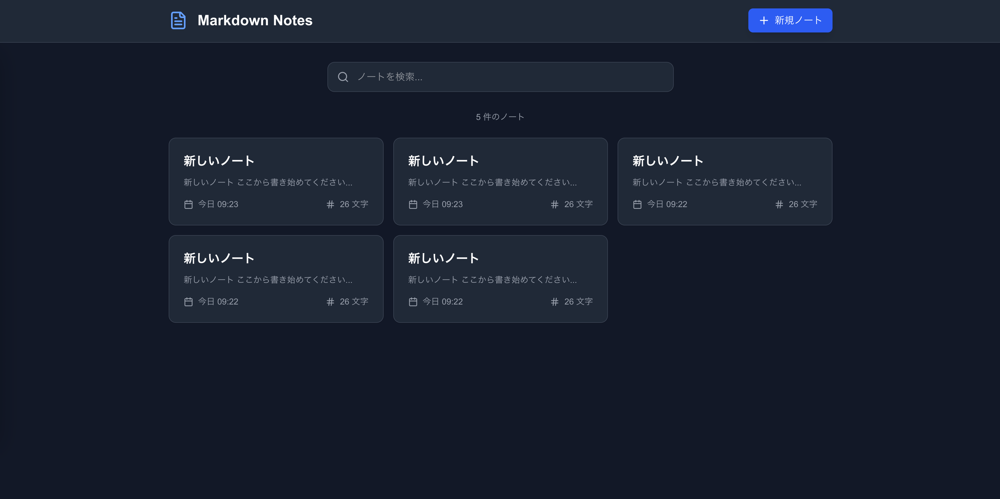
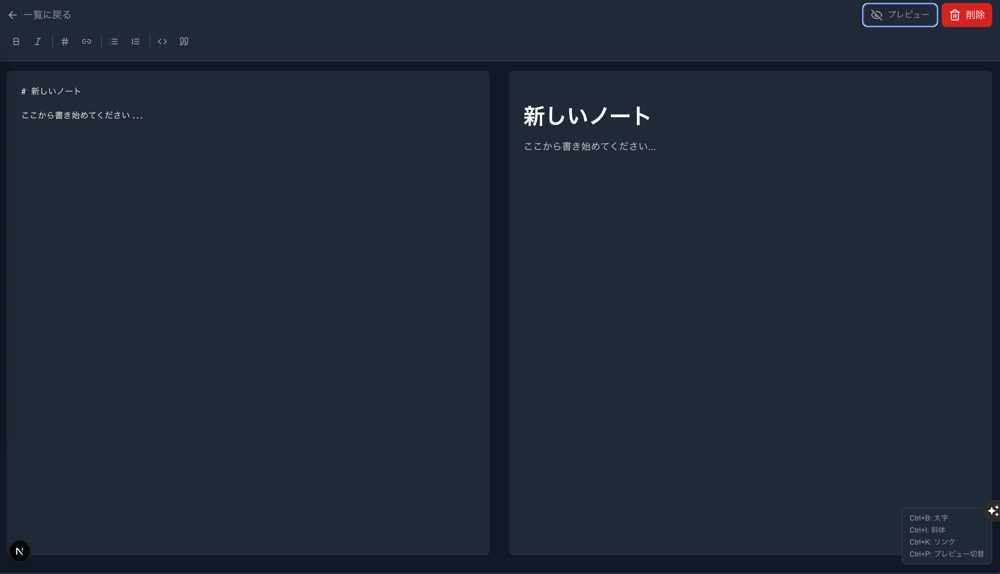

# 📝 Markdown Note Editor

<div align="center">
  
**美しく、高性能、プライバシー重視のローカルMarkdownエディタ**

[](https://www.typescriptlang.org/)
[](https://nextjs.org/)
[](https://tailwindcss.com/)
[](https://reactjs.org/)

</div>

## 📖 概要

このプロジェクトは、Claude Codeを使用して開発されたモダンなMarkdownノートエディタです。完全にローカルで動作し、プライバシーを重視しながら、直感的で美しいユーザーインターフェースを提供します。

### ✨ 主な特徴

- 🚀 **高性能**: 最新のNext.js 15 + React 19で構築
- 🔒 **プライバシー重視**: データは全てローカルストレージに保存
- 🎨 **モダンUI**: TailwindCSS 4による洗練されたデザイン
- ⚡ **リアルタイムプレビュー**: 書きながら即座に結果を確認
- 📱 **レスポンシブ**: デスクトップ、タブレット、モバイル対応
- 🌙 **ダークモード**: システム設定に自動対応

### ホーム画面（ノート一覧）


### エディタ画面


## 🚀 機能一覧

### ✍️ **エディタ機能**

| 機能 | 説明 |
|------|------|
| 📝 **リアルタイムプレビュー** | Markdownを書きながら即座にプレビューを確認 |
| 💾 **自動保存** | 500msのデバウンスで自動的にノートを保存 |
| 🔧 **ツールバー** | 太字、斜体、リンク、リスト、コードブロック等の挿入ボタン |
| ⌨️ **キーボードショートカット** | 効率的な編集のための豊富なショートカット |

### 📋 **ノート管理**

| 機能 | 説明 |
|------|------|
| 🔍 **高速検索** | タイトルと本文から瞬時に検索 |
| 🏷️ **自動タイトル生成** | H1タグまたは最初の行から自動でタイトルを抽出 |
| 📊 **ノート統計** | 文字数カウント、更新日時の表示 |
| 🗑️ **安全な削除** | 確認ダイアログ付きの削除機能 |

### 🎨 **UI/UX**

| 機能 | 説明 |
|------|------|
| 🌙 **ダークモード** | システム設定に自動対応 |
| 📱 **レスポンシブデザイン** | あらゆるデバイスサイズに対応 |
| ✨ **美しいアニメーション** | カスタムCSS transitionによる滑らかな操作感 |
| 🇯🇵 **日本語対応** | 完全日本語UI |

## ⌨️ キーボードショートカット

| ショートカット | 機能 |
|----------------|------|
| `Ctrl + B` | **太字**（**bold**） |
| `Ctrl + I` | *斜体*（*italic*） |
| `Ctrl + K` | リンク挿入 |
| `Ctrl + P` | プレビュー表示切替 |
| `Ctrl + S` | 保存確認メッセージ |

## 🛠 技術スタック

### **フロントエンド**
- **[Next.js 15](https://nextjs.org/)** - Reactフレームワーク（App Router）
- **[React 19](https://reactjs.org/)** - UIライブラリ（最新機能対応）
- **[TypeScript](https://www.typescriptlang.org/)** - 型安全性の確保
- **[TailwindCSS 4](https://tailwindcss.com/)** - モダンなスタイリング

### **ライブラリ & ツール**
- **[react-markdown](https://github.com/remarkjs/react-markdown)** - Markdownレンダリング
- **[lucide-react](https://lucide.dev/)** - アイコンセット
- **[react-hot-toast](https://react-hot-toast.com/)** - 通知システム
- **[@tailwindcss/typography](https://tailwindcss.com/docs/typography-plugin)** - タイポグラフィ

### **開発環境**
- **[ESLint](https://eslint.org/)** - コード品質チェック
- **[PostCSS](https://postcss.org/)** - CSS処理
- **Native Crypto API** - UUID生成（外部依存なし）

## 📁 プロジェクト構成

```
markdown-note-editor/
├── app/                          # Next.js App Router
│   ├── components/               # UIコンポーネント
│   │   ├── ui/                   # 共通UIコンポーネント
│   │   │   ├── Button.tsx        # ボタンコンポーネント
│   │   │   ├── Card.tsx          # カードコンポーネント
│   │   │   ├── IconButton.tsx    # アイコンボタン
│   │   │   └── Input.tsx         # 入力フィールド
│   │   ├── EditorHeader.tsx      # エディタヘッダー
│   │   ├── EditorToolbar.tsx     # エディタツールバー
│   │   ├── EmptyState.tsx        # 空状態表示
│   │   ├── Header.tsx            # メインヘッダー
│   │   ├── MarkdownPreview.tsx   # プレビューコンポーネント
│   │   ├── NoteCard.tsx          # ノートカード
│   │   └── SearchBar.tsx         # 検索バー
│   ├── edit/[id]/               # ノート編集ページ
│   │   └── page.tsx             # 動的ルートページ
│   ├── hooks/                   # カスタムHooks
│   │   ├── useDebounce.ts       # デバウンス処理
│   │   ├── useKeyboardShortcuts.ts # キーボードショートカット
│   │   ├── useNotes.ts          # ノート管理フック
│   │   └── useTheme.ts          # テーマ管理
│   ├── providers/               # Reactプロバイダー
│   │   └── ThemeProvider.tsx    # テーマプロバイダー
│   ├── types/                   # TypeScript型定義
│   │   ├── events.ts            # イベント型定義
│   │   └── note.ts              # Note型定義
│   ├── utils/                   # ユーティリティ関数
│   │   ├── cn.ts                # CSSクラス結合
│   │   ├── date.ts              # 日付フォーマット
│   │   └── storage.ts           # ローカルストレージ操作
│   ├── globals.css              # グローバルスタイル
│   ├── layout.tsx               # ルートレイアウト
│   └── page.tsx                 # ホームページ（ノート一覧）
├── assets/                      # 静的リソース
│   └── screenshots/             # スクリーンショット
├── public/                      # 公開ファイル
├── eslint.config.mjs           # ESLint設定
├── next.config.ts              # Next.js設定
├── tailwind.config.js          # TailwindCSS設定
└── tsconfig.json               # TypeScript設定
```

## 🚀 セットアップ

### **必要な環境**

- **Node.js**: 20.0.0 以上
- **npm**: 最新版推奨

### **クイックスタート**

```bash
# リポジトリのクローン
git clone <repository-url>
cd markdown-note-editor

# 依存関係のインストール
npm install

# 開発サーバーの起動
npm run dev
```

ブラウザで [http://localhost:3000](http://localhost:3000) を開いてアプリを使用できます。

### **その他のコマンド**

```bash
# 本番ビルドの作成
npm run build

# 本番サーバーの起動
npm run start

# コード品質チェック
npm run lint

# TypeScript型チェック
npx tsc --noEmit
```

## 💾 データストレージ

このアプリケーションは **ブラウザのローカルストレージ** を使用してノートを保存します：

### **特徴**

- 🔒 **完全プライベート**: データはブラウザ内にのみ保存
- 🚀 **高速アクセス**: メモリキャッシュによる最適化
- 📱 **オフライン対応**: インターネット接続不要
- 🔐 **デバイス固有**: ブラウザ・デバイスごとにデータが分離

### **技術的な実装**

- ローカルストレージ操作の抽象化
- 5秒間のメモリキャッシュによるパフォーマンス向上
- 自動的なエラーハンドリング

## 🔧 カスタマイズ

### **テーマのカスタマイズ**

`tailwind.config.js` でカラーパレット、アニメーション、タイポグラフィを変更可能：

```javascript
// 例：カスタムカラーの追加
theme: {
  extend: {
    colors: {
      custom: {
        50: '#f0f9ff',
        500: '#0ea5e9',
        900: '#0c4a6e'
      }
    }
  }
}
```

### **ストレージの変更**

`app/utils/storage.ts` を編集してデータ保存方法を変更可能：

```typescript
// 例：IndexedDB、外部API、ファイルシステムなど
export const saveNote = async (note: Note): Promise<void> => {
  // カスタム保存ロジック
};
```

### **新しいコンポーネントの追加**

1. `app/components/ui/` に共通コンポーネント
2. `app/components/` に機能固有コンポーネント
3. `app/hooks/` にカスタムフック

## 🏗️ アーキテクチャ

### **コンポーネント設計**

- **コンポジション重視**: 小さく再利用可能なコンポーネント
- **Props型定義**: 厳密なTypeScriptインターフェース
- **責務分離**: UIロジックとビジネスロジックの分離

### **状態管理**

- **ローカル状態**: React Hook（useState, useEffect）
- **共有状態**: カスタムフック（useNotes）
- **キャッシュ**: メモリベースの高速キャッシュ

### **パフォーマンス最適化**

- **デバウンス**: 自動保存の最適化
- **遅延レンダリング**: useDeferredValueの活用
- **メモ化**: useMemoによる計算量削減

## 🤝 コントリビューション

プロジェクトへの貢献を歓迎します！

### **貢献方法**

1. このリポジトリをフォーク
2. 機能ブランチを作成（`git checkout -b feature/amazing-feature`）
3. 変更をコミット（`git commit -m 'feat: 素晴らしい機能を追加'`）
4. ブランチにプッシュ（`git push origin feature/amazing-feature`）
5. Pull Requestを作成

### **開発ガイドライン**

- **コミットメッセージ**: [Conventional Commits](https://www.conventionalcommits.org/)
- **コードスタイル**: ESLint + Prettier
- **型安全性**: 厳密なTypeScript

## 最後に

このプロジェクトは、初めて [Claude Code](https://claude.ai/code) を使用して開発してみたものです。
AIアシスタントと数ラリーのやりとりで、こちらの**Markdown Note Editor**が実現しています。


<div align="center">

**Markdown Note Editor** で美しく効率的なノート作成体験をお楽しみください 🚀

[🔝 ページトップに戻る](#-markdown-note-editor)

</div>